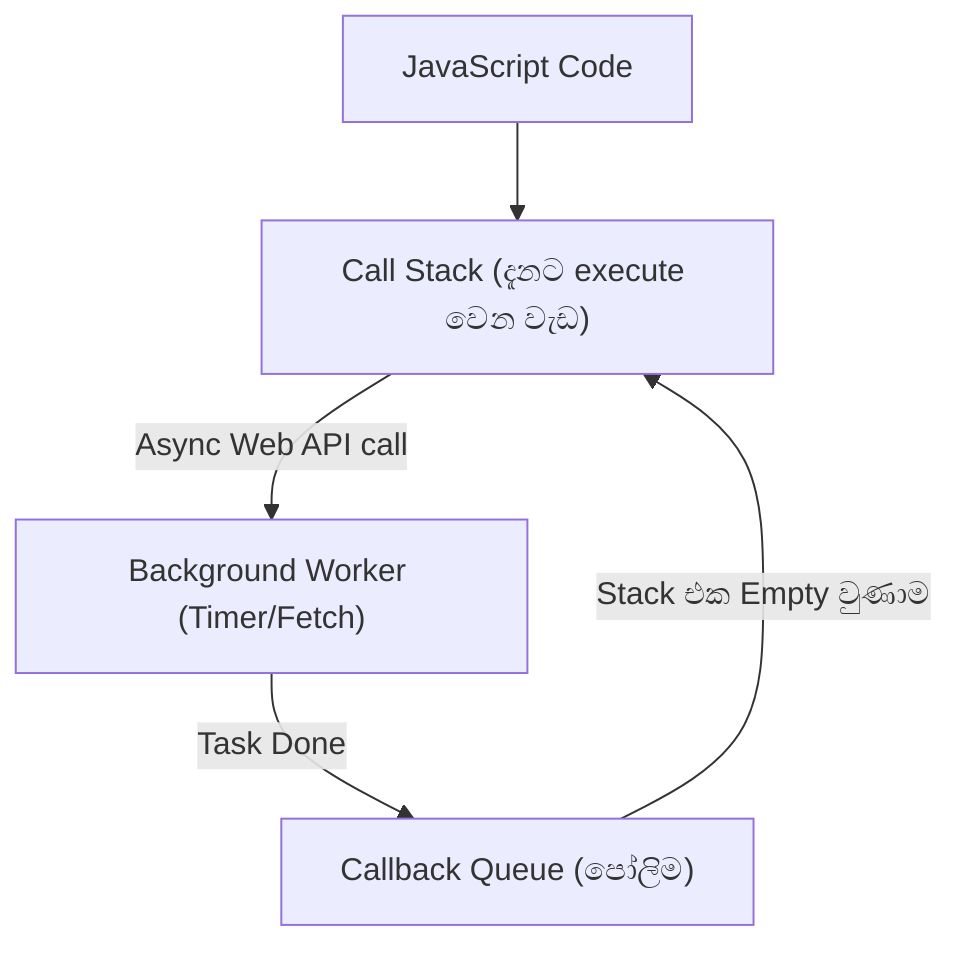

# Sinhala Explainer Examples and Scenarios

This reference provides concrete demonstrations of the pedagogical patterns used by `/sinhala-explainer`.

---

## Example 1: Explaining an Asynchronous JavaScript Concept (Event Loop & Promises)

### 1. 🎯 Quick Snapshot
JavaScript එක Single-Threaded වුණත් කොහොමද එක වෙලාවට වැඩ කීපයක් non-blocking විදිහට කරන්නේ කියන එක පාලනය කරන්නේ **Event Loop** එකෙන්.

### 2. 🔑 Technical Term Glossary
- **`Single-Threaded`**: (එක පාරකට එක task එකක් විතරක් execute කරන්න පුළුවන් CPU thread එකක් තිබීම)
- **`Call Stack`**: (දැනට run වෙන functions පිළිවෙළට තියාගන්න stack structure එක)
- **`Callback Queue`**: (Background tasks ඉවර වුණාම Stack එක නිදහස් වෙනකල් පෝලිමේ ඉන්න තැන)
- **`Non-blocking I/O`**: (Database request හෝ Network call එකක් ඉවර වෙනකල් මුළු program එකම freeze නොවී ඉතුරු වැඩ කරගෙන යෑමේ හැකියාව)

### 3. 💡 Everyday Analogy (තේ කඩේ උපමාව)
හිතන්න ඔයා තේ කඩේකට ගිහින් Plain Tea එකකුයි Egg Roti එකකුයි order කරනවා.
- Cashier (Call Stack) ඔයාගේ order එක ලියාගෙන kitchen එකට දෙනවා.
- Roti එක හදනකල් cashier ඔයාව එතන නවත්තන් ඉන්නේ නෑ (Non-blocking). ඊළඟ customer ගෙන් order එක ගන්නවා.
- Roti එක හැදුණු ගමන් බෙල් එක ගහලා (Callback Queue එකට දාලා) ඔයාට කෑම එක දෙනවා.
මෙන්න මේ cashier සහ kitchen අතර වැඩ ටික එක දිගට balance කරන්නේ **Event Loop** එක වගේ!

### 4. 📊 Visual Representation


### 5. 💻 Practical Code Snippet
```javascript
console.log("1. තේ එක Order කළා"); // Call Stack එකට ගිහින් කෙලින්ම run වෙනවා

// Background Task එකක් (Async operation)
setTimeout(() => {
    console.log("2. Egg Roti එක ලෑස්තියි!"); // Callback Queue එක හරහා Stack එක හිස් වුණාම run වෙනවා
}, 2000);

console.log("3. ඊළඟ customer ගේ order එක ගන්නවා"); // මුලින්ම run වෙනවා (Non-blocking)
```

---

## Example 2: Handling Web URLs & Documentation

When the user feeds a URL:
1. Agent calls `read_url_content` to fetch the markdown/text.
2. Identifies key technical architectural points.
3. Maps unfamiliar jargon to the Glossary section.
4. Breaks down the architecture into a spoken Sinhala step-by-step walkthrough.
5. Produces a Mermaid diagram mapping the flow.
6. Asks 1 interactive check-in question.
