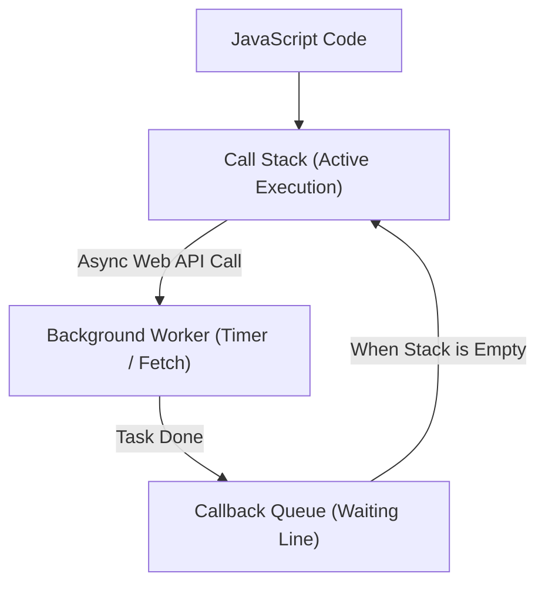

# Sinhala Explainer Examples and Scenarios

This reference provides concrete demonstrations of the pedagogical patterns used by `/sinhala-explainer`.

---

## Example 1: Full Explanation with Code & Analogy (Event Loop)

### 1. Goal
> "මේකෙන් අපි ඉගෙන ගන්නේ JavaScript Single-Threaded භාෂාවක් වෙලත් background tasks හිර නොවී එක දිගට වැඩ කරන්නේ කොහොමද කියන එක (Event Loop)."

### 2. දැනගන්න ඕන වචන
- **`Single-Threaded`**: එක පාරකට එක CPU task එකක් විතරක් execute කරන්න පුළුවන් architecture එකක්.
- **`Call Stack`**: දැනට run වෙන functions පිළිවෙළට තියාගන්න memory stack එක.
- **`Callback Queue`**: Background වැඩ ඉවර වුණාම Stack එක නිදහස් වෙනකල් පෝලිමේ ඉන්න තැන.
- **`Non-blocking`**: Database query හෝ network call එකක් ඉවර වෙනකල් මුළු application එකම freeze නොවී ඉතුරු වැඩ කරගෙන යෑමේ හැකියාව.

### 3. සරල උපමාවකින් තේරුම් ගමු (තේ කඩේ උපමාව)
හිතන්න ඔයා තේ කඩේකට ගිහින් Plain Tea එකකුයි Egg Roti එකකුයි order කරනවා:
- Cashier (Call Stack) ඔයාගේ order එක ලියාගෙන kitchen එකට දෙනවා.
- Roti එක හදනකල් cashier ඔයාව එතන නවත්තන් ඉන්නේ නැහැ (Non-blocking). ඊළඟ customer ගෙන් order එක ගන්නවා.
- Roti එක හැදුණු ගමන් බෙල් එක ගහලා (Callback Queue එකට දාලා) ඔයාට කෑම එක දෙනවා.
මෙන්න මේ cashier සහ kitchen අතර වැඩ balance කරන්නේ **Event Loop** එක වගේ!

### 4. How It Works (වැඩ කරන විදිහ සරලව)

> **Diagram එක බලන විදිහ:** JavaScript code එක මුලින්ම Call Stack එකේ run වෙනවා. Async වැඩක් ආවම Background එකට යවලා Call Stack එක නිදහස් කරනවා. වැඩේ ඉවර වුණාම Callback Queue එක හරහා නැවත Stack එකට එනවා.

### 5. හොඳ උදාහරණයක් (Code Walkthrough)

```javascript
console.log("1. Plain Tea Ordered");

setTimeout(() => {
    console.log("2. Egg Roti Ready!");
}, 2000);

console.log("3. Next Customer Served");
```

**Code එක වැඩ කරන විදිහ:**
1. පළවෙනි line එකෙන් synchronous විදිහට direct console output එක දෙනවා.
2. දෙවෙනි line එකෙන් `setTimeout` background timer එකට pass කරනවා. Browser එක තත්පර 2ක් background එකේ ගණන් කරනවා.
3. තුන්වෙනි line එක කිසිම delay එකක් නැතුව run වෙනවා.

**Output එක මෙහෙමයි:**
```text
1. Plain Tea Ordered
3. Next Customer Served
2. Egg Roti Ready!
```

### 6. කෙටියෙන් මතක තියාගන්න (Recap)
- JavaScript වල තියෙන්නේ එක Call Stack එකයි (Single-Threaded).
- බර වැඩ (Timers, Network requests) background workers ලට භාර දෙනවා (Non-blocking).
- Event Loop එකෙන් කරන්නේ Call Stack එක හිස් වෙනකල් බලන් ඉඳලා Queue එකේ තියෙන වැඩ Stack එකට දාන එකයි.

### 7. Interactive Check-in Challenge
දැන් ඔයාට පොඩි challenge එකක්: උඩ code එකේ `setTimeout` එකට `0` (Zero milliseconds) දැම්මොත්, `3. Next Customer Served` ට කලින් `2. Egg Roti Ready!` print වෙයිද? ඔයා මොකද හිතන්නේ?

---

## Example 2: Prerequisite Background Example

When prerequisite context is missing from the source material:
> *(මේක source එකේ නැහැ, ඒත් දැනගන්න ඕන)* HTTP කියන්නේ web browser එකයි server එකයි කතා කරන standard protocol එක. Headers කියන්නේ ඒ message එකත් එක්ක යන metadata (විස්තර).

---

## Example 3: Topic-Only (No Source) Example

When user passes only `/sinhala-explainer Docker containers`:
> "මේක මගේ දැනුම අනුව පැහැදිලි කරන්නේ, source එකක් දුන්නොත් ඒකෙන්ම කියන්නම්."
*(Continues with full 8-part structure)*
